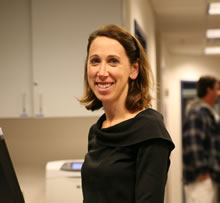

Welcome to First State Pediatrics! Previously "Kids First Newark" and "Kids First Hockessin", First State Pediatrics was established January 1, 2010 by five experienced board certified pediatricians in order to better serve our patients.
    	
#### Our Philosophy

Our goal is to establish a strong doctor-patient relationship with each family, and to earn your trust. We base our medical decisions on current treatment guidelines and evidence-based research. We aim to create a medical home environment, and to get to know your child personally. We strive to be gentle, accurate and punctual.

#### Convenience and Comfort

With convenient practice locations in Hockessin and Newark, First State Pediatrics is committed to providing premium pediatric care for infants through adolescents.&nbsp;We are proud to offer&nbsp;a modern and comfortable atmosphere for your children's medical needs at both locations.&nbsp;Your doctor will thoroughly evaluate your child and carefully&nbsp;answer your questions at every visit.

We utilize an electronic medical record for precise and secure documentation, as well as efficient electronic prescribing so that your child's medications are ready to pick up when you get to your pharmacy of choice.

#### Locations

Dr. John Murphy and Dr. Kathleen Leach, with their team of exceptional registered nurses and office staff, are pleased to offer state of the art medical care at their Newark location. We are happily accepting new patients of all ages at the Newark site.

Dr. Robert Olivieri, Dr. Amy Chang, and Dr. Lauren Healy, with their team of exceptional registered nurses and office staff, are pleased to offer state of the art medical care at their Hockessin location. We are happily accepting new patients of all ages at the Hockessin site.

Please call for more information.



## Meet the Hockessin Team

 
	
 
		  
	
 
	
 
		<h4 class="media-heading">Dr. Robert Olivieri</h4> 
		
Robert Olivieri, MD graduated from Department of Defense medical school, Uniformed Services University of the Health Sciences, F. Hebert School of Medicine in Bethesda, MD. Prior to medical school he attended Hobart College and Columbia University. He completed his internship and residency at the National Naval Medical Center in Bethesda, MD. Since retiring from the Navy in 1998, he has been practicing ambulatory pediatrics at our Hockessin office. Dr.Olivieri's professional interests include Infant Care and Development, Parenting Issues, Respiratory and Infectious Diseases, ADHD, Nutrition, and Adolescent Care. Dr. Olivieri is married to Nancy Petit, MD and they have a son Alexander and fraternal twins, Lauren and Andrew.

		
Dr. Olivieri is a board certified pediatrician and Fellow of the American Academy of Pediatrics.

	
 

 
	
 
		  
	
 
	
 
		<h4 class="media-heading">Dr. Lauren Healy</h4> 
		
Dr. Healy is a native of Wilmington.  She attended Archmere Academy for high school and then received her Bachelor of Arts in Psychology at Boston College.  She went on to attend medical school at Thomas Jefferson Medical College and completed her pediatric residency at Emory University in Atlanta, Georgia.  Dr. Healy joined the Hockessin practice in 2000.  Her husband and three daughters keep her busy at home.  She enjoys jogging and weekends at the beach.

		
Dr. Healy is a board certified pediatrician and Fellow of the American Academy of Pediatrics.

	
 

 
	
 
		  
	
 
	
 
		<h4 class="media-heading">Dr. Amy Chang</h4> 
		
Dr. Amy Chang is a board certified pediatrician and Fellow of the American Academy of Pediatrics who hails from Long Island, NY.  She earned both her BA in Psychology and her MD degree from The George Washington University in Washington, DC, and then completed her pediatric internship and residency at Thomas Jefferson University/AI duPont Hospital for Children here in Wilmington.  She joined the Hockessin practice in 2004.  Dr. Chang is active in her church, and enjoys reading, traveling, and all things musical.

	
 

	

		
 
			 
			
 
				<h5>RN: Kathy</h5> 
			
 
		

	

	

		
 
			 
			
 
				<h5>RN: Debi</h5> 
			
 
		

	

	

		
 
			 
			
 
				<h5>RN: Jen</h5> 
			
 
		

	

	

		
 
			 
			
 
				<h5>RN: Susan</h5> 
			
 
		

	

	

		
 
			 
			
 
				<h5>RN: Becky</h5> 
			
 
		

	

	

		
 
			 
			
 
				<h5>Front Office: Sandy</h5> 
			
 
		

	

	

		
 
			 
			
 
				<h5>Front Office: Nicole</h5> 
			
 
		

	

	

		
 
			 
			
 
				<h5>Front Office: Becky</h5> 
			
 
		

	

	

		
 
			 
			
 
				<h5>Front Office: Elise</h5> 
			
 
		

	

	

		
 
			 
			
 
				<h5>Front Office: Karen</h5> 
			
 
		

	

    	


## Meet the Newark Team

 
	
 
		  
	
 
	
 
		<h4 class="media-heading">Dr. John Murphy</h4> 
		
Dr. Murphy grew up in Delaware, attending Archmere Academy for high school. He majored in Biology at St. Joseph's University in Philadelphia. He then attended Georgetown University School of Medicine and completed his residency in Pediatrics there as well. Dr. Murphy joined the Newark Practice in 2000. He enjoys golf when not spending time with his wife and their three children.

		
Dr. Murphy is a board certified pediatrician and Fellow of the American Academy of Pediatrics.

	
 

 
	
 
		  
	
 
	
 
		<h4 class="media-heading">Dr. Kathleen Leach</h4> 
		
Dr. Leach is a native of Delaware County, PA. She received her bachelor of science degree in cultural anthropology from Bates College and completed her pre-medicine studies at the University of Maine. Dr. Leach studied medicine at Drexel University College of Medicine and attended the Thomas Jefferson University / A. I. duPont Hospital for Children pediatric residency. She joined the practice in 2006. In her spare time Dr. Leach enjoys bicycling and skiing. Dr Leach and her husband welcomed their first child, a baby boy, in March 2011.

		
Dr. Leach is a board certified pediatrician and Fellow of the American Academy of Pediatrics.

	
 

	

		
 
			 
			
 
				<h5>RN: Deb</h5> 
			
 
		

	

	

		
 
			 
			
 
				<h5>RN: Karla</h5> 
			
 
		

	

	

		
 
			 
			
 
				<h5>Front Office: Linda</h5> 
			
 
		

	

	

		
 
			 
			
 
				<h5>Front Office: Sherri</h5> 
			
 
		

	

	

		
 
			 
			
 
				<h5>RN: Lisa</h5> 
			
 
		

	

